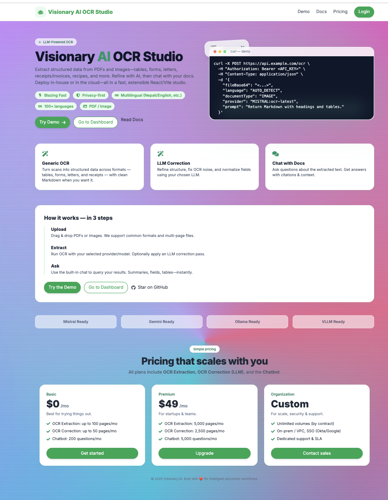
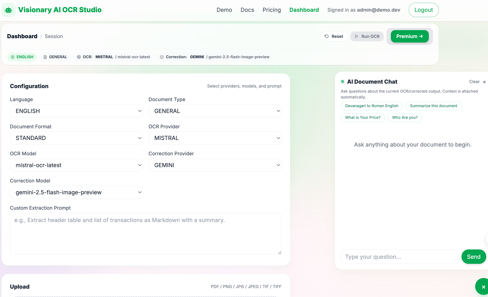
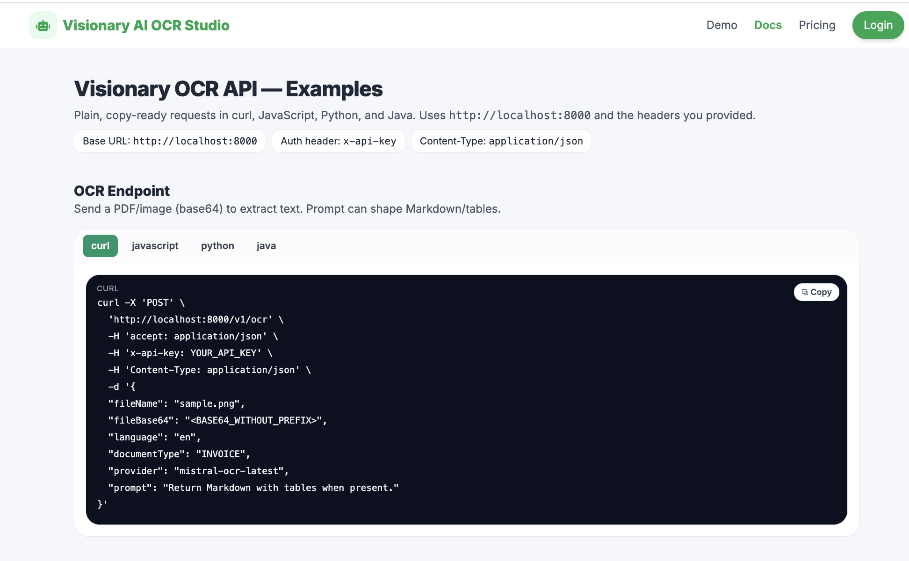
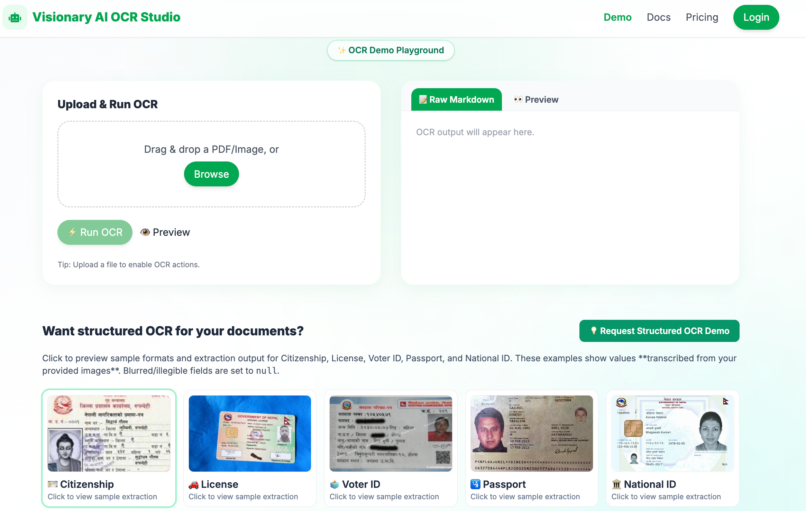
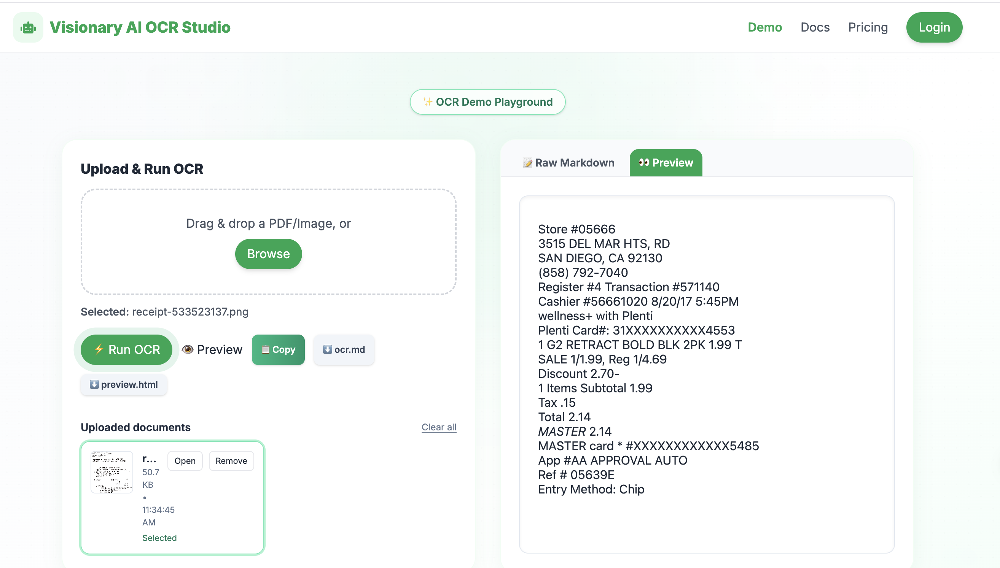

# AI OCR Studio

A powerful, production-ready OCR (Optical Character Recognition) application with AI-powered text correction and document analysis capabilities. Built with FastAPI backend and React TypeScript frontend.

## ⚡ Quick Start

```bash
# 1. Clone and setup backend
cd backend
python3 -m venv venv
source venv/bin/activate  # On Windows: venv\Scripts\activate
pip install -r requirements.txt

# 2. Create backend/.env file with your API keys
# (See Environment Configuration section below)

# 3. Start backend
uvicorn main:app --reload --host 0.0.0.0 --port 8000

# 4. In a new terminal, setup frontend
cd fronted
pnpm install  # or npm install
cp .env.example .env  # Edit with your backend URL

# 5. Start frontend
pnpm dev  # or npm run dev

# 6. Open http://localhost:7090/home in your browser
```

## 📸 Screenshots

### Dashboard


### Chat Interface


### Documentation Page


### Sample Document


### Sample OCR Output


## 🚀 Features

- **Multi-Provider OCR Support**: Supports multiple OCR providers including Gemini, Mistral, Ollama, and VLLM
- **AI-Powered Text Correction**: Automatic text correction and enhancement using LLM models
- **Document Type Support**: Handles various document types (passports, citizenship cards, driving licenses, general documents)
- **PDF & Image Processing**: Supports both PDF files and image formats (PNG, JPG, JPEG, TIF, TIFF)
- **Structured Data Extraction**: Automatic JSON parsing and field extraction from documents
- **Multi-language Support**: Supports English, Nepali, and auto-detection
- **Modern UI**: Beautiful, responsive React frontend with Tailwind CSS
- **RESTful API**: Well-documented FastAPI backend with automatic API documentation
- **Real-time Processing**: Fast document processing with progress tracking

## 📋 Tech Stack

### Backend
- **FastAPI** - Modern Python web framework
- **Python 3.11+** - Programming language
- **Uvicorn/Gunicorn** - ASGI server
- **Pillow, PyMuPDF, pdf2image** - Image and PDF processing
- **Google Generative AI, Mistral AI, Ollama** - LLM integrations
- **Pydantic** - Data validation
- **Loguru** - Logging

### Frontend
- **React 18** - UI library
- **TypeScript** - Type-safe JavaScript
- **Vite** - Build tool and dev server
- **Tailwind CSS** - Utility-first CSS framework
- **React Router** - Client-side routing
- **React Icons** - Icon library

## 📦 Prerequisites

Before you begin, ensure you have the following installed:

- **Python 3.11+** ([Download](https://www.python.org/downloads/))
- **Node.js 18+** and **pnpm/npm** ([Download Node.js](https://nodejs.org/))
- **Git** ([Download](https://git-scm.com/downloads))
- **Docker** (optional, for containerized deployment)

### Additional Backend Requirements

For PDF processing:
- **poppler-utils** (Linux/macOS)
- **Ghostscript** (optional, for advanced PDF features)

Install on Ubuntu/Debian:
```bash
sudo apt-get update
sudo apt-get install -y poppler-utils
```

Install on macOS:
```bash
brew install poppler
```

## 🛠️ Installation & Setup

### 1. Clone the Repository

```bash
git clone <repository-url>
cd ai-ocr-studio
```

### 2. Backend Setup

#### Create Virtual Environment

```bash
cd backend
python3 -m venv venv

# Activate virtual environment
# On macOS/Linux:
source venv/bin/activate
# On Windows:
venv\Scripts\activate
```

#### Install Dependencies

```bash
pip install --upgrade pip
pip install -r requirements.txt
```

#### Environment Configuration

Create a `.env` file in the `backend/` directory:

```bash
cd backend
cp .env.example .env  # If example exists, or create manually
```

Edit `.env` with your configuration:

```env
# App Configuration
APP_NAME=Visionary OCR API
API_V1_PREFIX=/v1
ENV=development

# CORS (comma-separated origins)
CORS_ORIGINS=http://localhost:7090,http://localhost:5173

# Optional API Key Authentication
API_KEY=your-secret-api-key-here

# OCR Provider Defaults
DEFAULT_OCR_PROVIDER=MISTRAL
DEFAULT_CORRECTION_PROVIDER=GEMINI_OPENSOURCE

# API Keys (Required for respective providers)
MISTRAL_API_KEY=your-mistral-api-key
GEMINI_API_KEY=your-gemini-api-key

# Ollama Configuration (if using local Ollama)
OLLAMA_ENDPOINT=http://localhost:11434

# VLLM Server Configuration (if using VLLM)
VLLM_SERVER_URL=https://your-vllm-server.com
```

#### Get API Keys

1. **Mistral AI**: Sign up at [mistral.ai](https://mistral.ai) and get your API key
2. **Google Gemini**: Get your API key from [Google AI Studio](https://makersuite.google.com/app/apikey)
3. **Ollama**: Install locally from [ollama.ai](https://ollama.ai) (no API key needed)
4. **VLLM**: Configure your VLLM server endpoint

### 3. Frontend Setup

```bash
cd fronted

# Install dependencies using pnpm (recommended) or npm
pnpm install
# OR
npm install
```

#### Environment Configuration

Create a `.env` file in the `fronted/` directory:

```bash
cd fronted
cp .env.example .env  # If example exists
```

Edit `.env`:

```env
# Backend API URL
VITE_API_BASE_URL=http://localhost:8000

# Optional: API Key (if backend requires it)
VITE_API_KEY=your-secret-api-key-here
```

## 🚀 Running the Project

### Development Mode

#### Start Backend Server

```bash
cd backend
source venv/bin/activate  # Activate virtual environment

# Run with uvicorn (development)
uvicorn main:app --reload --host 0.0.0.0 --port 8000

# OR run directly with Python
python main.py
```

The backend API will be available at:
- **API**: http://localhost:8000
- **API Documentation**: http://localhost:8000/docs
- **Alternative Docs**: http://localhost:8000/redoc

#### Start Frontend Development Server

```bash
cd fronted

# Using pnpm
pnpm dev

# OR using npm
npm run dev
```

The frontend will be available at:
- **Frontend**: http://localhost:7090
- **Home Page**: http://localhost:7090/home

### Production Mode

#### Backend Production

Using Gunicorn with Uvicorn workers:

```bash
cd backend
source venv/bin/activate

gunicorn -c gunicorn_conf.py backend.app.main:app
```

Or with custom settings:

```bash
gunicorn backend.app.main:app \
  --bind 0.0.0.0:8000 \
  --workers 2 \
  --worker-class uvicorn.workers.UvicornWorker \
  --timeout 120
```

#### Frontend Production Build

```bash
cd fronted

# Build for production
pnpm build
# OR
npm run build

# Preview production build
pnpm preview
# OR
npm run preview
```

The built files will be in `fronted/dist/` directory.

## 🐳 Docker Deployment

### Using Docker Compose

```bash
# Build and start services
docker-compose -f backend/docker-compose.yml up --build

# Run in detached mode
docker-compose -f backend/docker-compose.yml up -d

# Stop services
docker-compose -f backend/docker-compose.yml down
```

### Using Dockerfile

```bash
cd backend

# Build image
docker build -t ai-ocr-studio:latest .

# Run container
docker run -p 8000:8000 \
  -e MISTRAL_API_KEY=your-key \
  -e GEMINI_API_KEY=your-key \
  ai-ocr-studio:latest
```

## 📁 Project Structure

```
ai-ocr-studio/
├── backend/                 # FastAPI backend
│   ├── app/
│   │   ├── api/            # API routes and endpoints
│   │   │   └── v1/
│   │   │       ├── endpoints/  # Individual endpoint files
│   │   │       └── router.py   # Main API router
│   │   ├── schemas/        # Pydantic models
│   │   └── services/       # Business logic
│   ├── config/             # Configuration files
│   ├── core/               # Core settings
│   ├── correction/         # Text correction providers
│   ├── ocr/                # OCR providers
│   ├── models/             # Data models
│   ├── utils/              # Utility functions
│   ├── main.py             # FastAPI app entry point
│   ├── requirements.txt    # Python dependencies
│   ├── Dockerfile          # Docker configuration
│   └── .env                # Environment variables (create this)
│
├── fronted/                 # React frontend
│   ├── src/
│   │   ├── components/     # React components
│   │   ├── pages/          # Page components
│   │   ├── services/       # API service functions
│   │   ├── types/          # TypeScript types
│   │   ├── auth/           # Authentication logic
│   │   └── App.tsx         # Main app component
│   ├── public/             # Static assets
│   ├── package.json        # Node dependencies
│   ├── vite.config.ts      # Vite configuration
│   └── .env                # Environment variables (create this)
│
├── ui_images/              # UI screenshots and images
│   ├── chat.png            # Chat interface screenshot
│   ├── dashoard.png        # Dashboard screenshot
│   ├── docs.png            # Documentation page screenshot
│   ├── sample_document.png # Sample document example
│   └── sample_ocr.png      # Sample OCR output example
│
└── README.md               # This file
```

## 🔌 API Endpoints

### Base URL
```
http://localhost:8000/v1
```

### Available Endpoints

#### Health Check
```http
GET /v1/health
```

#### List Available Models
```http
GET /v1/models?ocr_provider=GEMINI&correction_provider=GEMINI
```

#### OCR Processing
```http
POST /v1/ocr
Content-Type: application/json

{
  "fileName": "document.pdf",
  "fileBase64": "base64-encoded-image",
  "language": "ENGLISH",
  "documentType": "GENERAL",
  "provider": "GEMINI:gemini-1.5-flash"
}
```

#### Premium OCR (with correction)
```http
POST /v1/ocr_premium
Content-Type: application/json

{
  "base64_image": "base64-encoded-image",
  "ocr_provider": "MISTRAL",
  "correction_provider": "GEMINI_OPENSOURCE",
  "document_type": "GENERAL",
  "document_format": "STANDARD",
  "language": "AUTO_DETECT",
  "enable_json_parsing": true,
  "provider_config": {
    "ocr_model": "mistral-small-latest",
    "correction_model": "gemma-3-4b-it"
  }
}
```

#### Text Correction
```http
POST /v1/correct
Content-Type: application/json

{
  "text": "Text to correct",
  "model": "GEMINI_OPENSOURCE:gemma-3-4b-it",
  "prompt": "Correct OCR errors",
  "document_type": "GENERAL"
}
```

#### Chat with Documents
```http
POST /v1/chat
Content-Type: application/json

{
  "message": "What is the passport number?",
  "context": "Document text..."
}
```

For complete API documentation, visit http://localhost:8000/docs when the backend is running.

## 🔧 Configuration

### Supported OCR Providers

- **GEMINI** - Google Gemini API
- **GEMINI_OPENSOURCE** - Open source Gemini models (requires VLLM server)
- **MISTRAL** - Mistral AI API
- **OLLAMA** - Local Ollama instance
- **VLLM** - VLLM server endpoint

### Supported Document Types

- `GENERAL` - General documents
- `PASSPORT_FRONT` - Passport front page
- `CITIZENSHIP_BACK` - Citizenship card back
- `DRIVING_LICENSE` - Driving license
- `GOVERNMENT_DOCUMENT` - Government documents

### Supported Languages

- `ENGLISH`
- `NEPALI`
- `AUTO_DETECT` - Automatic language detection

## 📝 Development Guidelines

### Backend

- Follow PEP 8 style guide
- Use type hints for all functions
- Write docstrings for public functions
- Keep API endpoints focused and single-purpose

### Frontend

- Use TypeScript for type safety
- Follow React best practices
- Use functional components with hooks
- Keep components small and focused
- Use Tailwind CSS for styling

### Code Formatting

Backend (using Black):
```bash
cd backend
black .
```

Frontend (using ESLint):
```bash
cd fronted
pnpm lint
# OR
npm run lint
```

## 🐛 Troubleshooting

### Backend Issues

**Issue**: `ModuleNotFoundError` or import errors
- **Solution**: Ensure virtual environment is activated and dependencies are installed

**Issue**: PDF processing fails
- **Solution**: Install poppler-utils: `sudo apt-get install poppler-utils` (Linux) or `brew install poppler` (macOS)

**Issue**: API key errors
- **Solution**: Check `.env` file has correct API keys and file is in `backend/` directory

**Issue**: CORS errors
- **Solution**: Update `CORS_ORIGINS` in `.env` to include your frontend URL

### Frontend Issues

**Issue**: Cannot connect to backend API
- **Solution**: Check `VITE_API_BASE_URL` in `fronted/.env` matches backend URL

**Issue**: Build errors
- **Solution**: Clear node_modules and reinstall: `rm -rf node_modules && pnpm install`

**Issue**: Port already in use
- **Solution**: Change port in `vite.config.ts` or kill process using the port

## 📄 License

MIT License

Copyright (c) 2025 Team AI

Permission is hereby granted, free of charge, to any person obtaining a copy
of this software and associated documentation files (the "Software"), to deal
in the Software without restriction, including without limitation the rights
to use, copy, modify, merge, publish, distribute, sublicense, and/or sell
copies of the Software, and to permit persons to whom the Software is
furnished to do so, subject to the following conditions:

The above copyright notice and this permission notice shall be included in all
copies or substantial portions of the Software.

THE SOFTWARE IS PROVIDED "AS IS", WITHOUT WARRANTY OF ANY KIND, EXPRESS OR
IMPLIED, INCLUDING BUT NOT LIMITED TO THE WARRANTIES OF MERCHANTABILITY,
FITNESS FOR A PARTICULAR PURPOSE AND NONINFRINGEMENT. IN NO EVENT SHALL THE
AUTHORS OR COPYRIGHT HOLDERS BE LIABLE FOR ANY CLAIM, DAMAGES OR OTHER
LIABILITY, WHETHER IN AN ACTION OF CONTRACT, TORT OR OTHERWISE, ARISING FROM,
OUT OF OR IN CONNECTION WITH THE SOFTWARE OR THE USE OR OTHER DEALINGS IN THE
SOFTWARE.


## 🤝 Contributing

We welcome contributions from the community! Here's how you can help improve AI OCR Studio.

### Getting Started

1. **Fork the repository** on GitHub
2. **Clone your fork** locally:
   ```bash
   git clone https://github.com/your-username/ai-ocr-studio.git
   cd ai-ocr-studio
   ```
3. **Create a new branch** for your feature or bugfix:
   ```bash
   git checkout -b feature/your-feature-name
   # or
   git checkout -b fix/your-bugfix-name
   ```
4. **Set up the development environment** (see Installation & Setup section above)

### Development Workflow

1. **Make your changes** following the development guidelines below
2. **Test your changes** thoroughly:
   - Run backend tests: `cd backend && pytest`
   - Test the frontend: `cd fronted && pnpm test`
   - Manually test the features you've changed
3. **Commit your changes** with clear, descriptive commit messages:
   ```bash
   git commit -m "feat: add new OCR provider support"
   # or
   git commit -m "fix: resolve API endpoint routing issue"
   ```
4. **Push to your fork**:
   ```bash
   git push origin feature/your-feature-name
   ```
5. **Create a Pull Request** on GitHub with a clear description of your changes

### Commit Message Guidelines

We follow [Conventional Commits](https://www.conventionalcommits.org/) format:

- `feat:` - New feature
- `fix:` - Bug fix
- `docs:` - Documentation changes
- `style:` - Code style changes (formatting, etc.)
- `refactor:` - Code refactoring
- `test:` - Adding or updating tests
- `chore:` - Maintenance tasks

Examples:
- `feat: add Gemini 2.0 Flash support`
- `fix: resolve 404 error on OCR endpoint`
- `docs: update API documentation`
- `refactor: improve error handling in OCR service`

### Code Style Guidelines

#### Backend (Python)

- Follow **PEP 8** style guide
- Use **type hints** for all function parameters and return types
- Write **docstrings** for all public functions and classes
- Keep functions focused and single-purpose
- Use meaningful variable and function names
- Format code with **Black**:
  ```bash
  cd backend
  black .
  ```
- Run linting with **flake8**:
  ```bash
  cd backend
  flake8 .
  ```

#### Frontend (TypeScript/React)

- Use **TypeScript** for type safety
- Follow **React best practices**:
  - Use functional components with hooks
  - Keep components small and focused
  - Extract reusable logic into custom hooks
- Use **Tailwind CSS** for styling
- Format code with ESLint:
  ```bash
  cd fronted
  pnpm lint
  ```
- Follow naming conventions:
  - Components: PascalCase (e.g., `FileUploader.tsx`)
  - Functions/variables: camelCase (e.g., `handleSubmit`)
  - Constants: UPPER_SNAKE_CASE (e.g., `API_BASE_URL`)

### Pull Request Guidelines

1. **Keep PRs focused**: One feature or bugfix per PR
2. **Write clear descriptions**: Explain what changes you made and why
3. **Reference issues**: Link to related issues using keywords like "Fixes #123"
4. **Add tests**: Include tests for new features or bug fixes
5. **Update documentation**: Update README.md or API docs if needed
6. **Ensure CI passes**: Make sure all tests and linting pass

### Reporting Issues

When reporting bugs or requesting features:

1. **Check existing issues** to avoid duplicates
2. **Use clear, descriptive titles**
3. **Provide detailed information**:
   - Steps to reproduce (for bugs)
   - Expected vs actual behavior
   - Environment details (OS, Python version, Node version)
   - Error messages or logs
   - Screenshots if applicable

### Code Review Process

1. All PRs require at least one approval
2. Address review comments promptly
3. Be open to feedback and suggestions
4. Maintain a respectful and constructive tone

### Questions?

- Open an issue for bug reports or feature requests
- Start a discussion for questions or ideas
- Check existing documentation first

Thank you for contributing to AI OCR Studio! 🎉

## 📞 Support

For issues and questions:
- Open an issue on GitHub
- Check API documentation at `/docs` endpoint
- Review backend logs in `app/logs/` directory

## 🎯 Roadmap

- [ ] Add more OCR providers
- [ ] Enhanced document type support
- [ ] Batch processing capabilities
- [ ] User authentication and authorization
- [ ] Cloud storage integration
- [ ] Advanced analytics dashboard

---